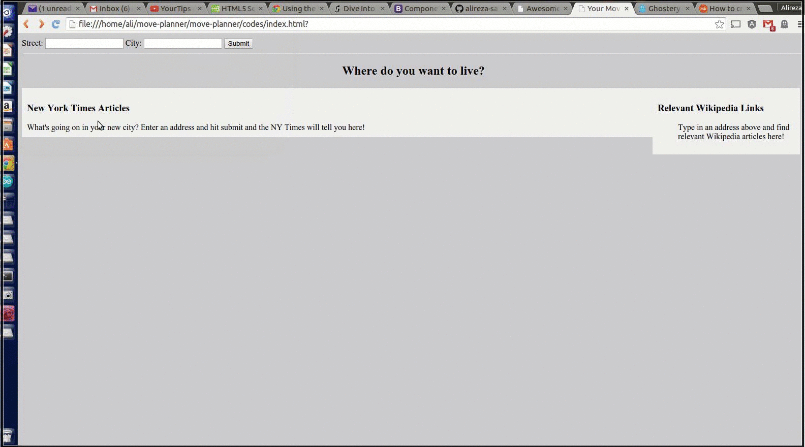

# move-planner
The user enter street address and city name. and the output will a background image from address, New York Times data about location and the Wikipedia information about location.

It is Combination of jQuery AJAX calls with 

- [Google Street View Image API](https://developers.google.com/maps/documentation/streetview/intro): the easy one
- [NYtime API](http://developer.nytimes.com/docs): You need and API key to use it
- [MediaWiki API](https://www.mediawiki.org/wiki/API:Main_page): JSONP is used to turn around cross-origin problem.

